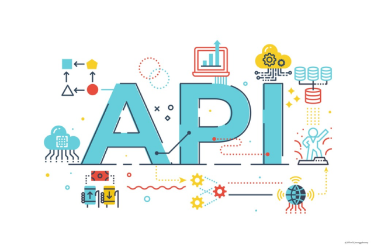

# product_manager_api



# 🛍️ API de Gerenciamento de Produtos

Aplicação RESTful feita com **Python Flask**, **SQLAlchemy**, **MySQL** e **Docker**, com retorno de dados em JSON. Gerencie produtos com operações de listagem, criação, atualização e remoção.

## 🚀 Tecnologias

- Python 3.x
- Flask
- SQLAlchemy
- MySQL
- Docker / Docker Compose

## 🔧 Instalação com Docker

```bash
git clone https://github.com/seunome/gerenciador-produtos.git
cd gerenciador-produtos
docker-compose up --build
```

## ⚙️ Endpoints

| Método | Rota               | Ação                   |
| ------- | ------------------ | ------------------------ |
| GET     | `/produtos`      | Listar todos os produtos |
| GET     | `/produtos/<id>` | Obter produto por ID     |
| POST    | `/produtos`      | Criar novo produto       |
| PUT     | `/produtos/<id>` | Atualizar produto        |
| DELETE  | `/produtos/<id>` | Deletar produto          |

## 💡 Exemplo de JSON (POST/PUT)

```json
  "nome": "Notebook",
  "preco": 2999.99,
  "estoque": 10
}
```

## 🗃️ Banco de Dados

- A aplicação usa MySQL como banco e cria a tabela `produto` automaticamente ao subir com Docker.

## 🐳 docker-compose.yml (exemplo)

```yaml
version: '3.8'
services:
  app:
    build: .
    ports:
      - "5000:5000"
    depends_on:
      - db
    environment:
      - FLASK_ENV=development
    volumes:
      - .:/app

  db:
    image: mysql:8.0
    restart: always
    environment:
      MYSQL_ROOT_PASSWORD: password
      MYSQL_DATABASE: produtos_db
    ports:
      - "3306:3306"

```

## 📁 Estrutura

```bash
.
├── app.py                     # Inicialização da app e configuração
└── src/
    ├── models/
    │   └── produto.py         # Modelo Produto (camada de entidade)
    ├── services/
    │   └── produto_service.py # Regras de negócio (camada de serviço)
    └── routes/
        └── produto_routes.py  # Rotas HTTP (camada de interface)


```

🫡Responsabilidades:

- **`models`**: define a estrutura de dados.
- **`services`**: lida com lógica de aplicação e banco.
- **`routes`**: expõe endpoints RESTful da API.


## ✨ Melhoria futura

- Autenticação com JWT
- Paginação e filtros
- Testes com Pytest
- Swagger/OpenAPI
-
